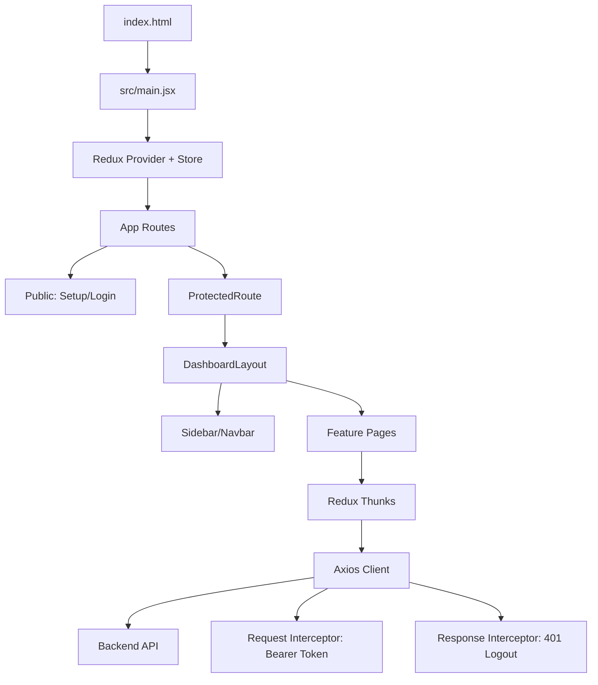

# MLDock Frontend Complete Deep Dive

This is a full interview-prep guide for the MLDock frontend.
It is designed so you can answer:
- What each frontend file does
- How the app boots and routes work
- How auth and API calls are handled
- How Redux state is structured
- Why UI components are organized this way
- What trade-offs, risks, and improvements exist

---

## 1) High-Level Frontend Architecture

MLDock frontend is a React + Vite single-page application (SPA) with:
- React Router for route structure and auth-gated pages
- Redux Toolkit for global async state management
- Axios instance with interceptors for centralized auth header and 401 handling
- Tailwind CSS + reusable UI primitives for consistent design system

### Layered view
1. Routing/layout layer: App routes, protected shell, sidebar/navbar
2. Page layer: feature screens (Dashboard, Models, Upload, Playground, Logs)
3. State layer: Redux slices and async thunks
4. API transport layer: shared Axios client
5. Presentation layer: reusable UI components (Button, Input, Dialog, Table, etc.)

---

## 2) App Boot and Runtime Flow

## Boot flow
1. Browser opens `frontend/index.html`.
2. Vite loads `src/main.jsx`.
3. `main.jsx` renders React root with Redux Provider.
4. `App.jsx` defines route tree and guard behavior.

## Auth and route flow
1. Public routes:
- `/setup`
- `/login`

2. Protected routes:
- `/`
- `/models`
- `/models/upload`
- `/models/:id`
- `/api-keys`
- `/playground`
- `/logs`

3. `ProtectedRoute` checks `auth.isAuthenticated` from Redux.
4. If unauthenticated, redirect to `/login`.
5. If authenticated, render `DashboardLayout`.

## Dashboard shell flow
1. `DashboardLayout` dispatches `fetchUser` on mount.
2. Shell renders shared `Sidebar`, `Navbar`, and nested page outlet.

## HTTP flow
1. All requests use shared Axios client.
2. Request interceptor injects `Authorization: Bearer <token>` from localStorage.
3. Response interceptor catches `401` and forces logout behavior (token clear + redirect).

---

## 3) File-by-File Deep Explanation

## Root frontend files

### `frontend/index.html`
Purpose:
- HTML entry file with root mount node for React.

Interview point:
- In Vite apps, this is the single page shell where client app mounts.

### `frontend/package.json`
Purpose:
- Dependencies and scripts.

Key scripts:
- `dev`: start dev server
- `build`: production build
- `preview`: preview built app
- `lint`: lint source

Major dependencies:
- React 19, React Router 7, Redux Toolkit, React-Redux, Axios, Tailwind, Lucide icons.

### `frontend/package-lock.json`
Purpose:
- Exact dependency resolution for reproducible installs.

### `frontend/vite.config.js`
Purpose:
- Vite dev configuration.

Important behavior:
- `/api` proxy forwards to backend and rewrites prefix.

Interview point:
- Proxy avoids CORS pain in local development and keeps frontend code using relative `/api/...` paths.

### `frontend/tailwind.config.js`
Purpose:
- Tailwind scanning paths and design tokens.

Important settings:
- Content globs for JSX files
- Custom color palette
- Surface/border/radius/shadow tokens
- Poppins font family extension

Interview point:
- Theme tokens make utility classes more semantic and scalable.

### `frontend/postcss.config.js`
Purpose:
- Configures Tailwind and Autoprefixer PostCSS pipeline.

### `frontend/Dockerfile`
Purpose:
- Multi-stage production build.

Flow:
1. Build static assets with Node stage
2. Serve with Nginx stage
3. Configure SPA fallback to `index.html`

Interview point:
- This pattern produces smaller runtime images and supports client-side routing refreshes.

### `frontend/.oxlintrc.json`
Purpose:
- Lint rules configuration for React/hook safety.

### `frontend/.gitignore`
Purpose:
- Ignore local artifacts and build outputs.

### `frontend/README.md`
Purpose:
- Template README currently not project-specific.

### `frontend/public/favicon.svg`
Purpose:
- Browser tab icon.

### `frontend/public/icons.svg`
Purpose:
- Shared icon sprite asset (template style static icon set).

---

## Source entry and global styles

### `frontend/src/main.jsx`
Purpose:
- React entrypoint.

What it does:
- Imports global CSS
- Creates React root
- Wraps app with Redux Provider and injects store

Syntax concepts:
- `React.StrictMode` for development diagnostics
- Provider pattern for global state context

### `frontend/src/index.css`
Purpose:
- Global CSS + Tailwind layers.

What it contains:
- Font import
- `@tailwind base/components/utilities`
- Base body typography/background defaults

Interview point:
- Base layer is used for app-wide reset and shared visual defaults.

### `frontend/src/App.css`
Purpose:
- Legacy/template CSS file.

Interview point:
- Mention cleanup opportunity if unused to reduce maintenance noise.

---

## Routing and shell composition

### `frontend/src/App.jsx`
Purpose:
- Central route map.

Key structure:
- Public routes (`/setup`, `/login`)
- Protected route wrapper (`ProtectedRoute`)
- Shared dashboard shell (`DashboardLayout`)
- Feature pages nested within protected shell

Interview point:
- Route composition keeps auth logic centralized and prevents duplication per page.

### `frontend/src/components/ProtectedRoute.jsx`
Purpose:
- Guard component for route-level authentication.

Behavior:
- If not authenticated -> redirect to login
- Else -> render nested outlet

Syntax concept:
- React Router `Navigate` and `Outlet` for declarative guard patterns.

### `frontend/src/components/layout/DashboardLayout.jsx`
Purpose:
- Shared authenticated app chrome.

What it does:
- Fetches current user on mount
- Renders sidebar + navbar + routed content area

Interview point:
- Great example of separating app shell from feature views.

### `frontend/src/components/layout/Sidebar.jsx`
Purpose:
- Left navigation menu.

What it does:
- Defines nav items list
- Uses `NavLink` active-state classes
- Links to dashboard features

Interview point:
- Config-driven nav list is easier to extend and maintain.

### `frontend/src/components/layout/Navbar.jsx`
Purpose:
- Top bar with identity and logout action.

What it does:
- Displays username from auth state
- Calls logout via custom auth hook

---

## API transport and auth hook

### `frontend/src/api/axios.js`
Purpose:
- Shared Axios client and interceptors.

Request interceptor:
- Reads token from localStorage
- Adds bearer token header

Response interceptor:
- Handles 401 globally
- Clears token and redirects to login route (guarded conditions)

Interview point:
- Centralized cross-cutting concern avoids duplicating auth handling in every thunk/page.

### `frontend/src/hooks/useAuth.js`
Purpose:
- Custom hook around auth slice + logout action.

What it exposes:
- `user`, `isAuthenticated`, `status`, etc.
- `logout` helper

Interview point:
- Hook abstraction keeps components cleaner and more consistent.

---

## UI primitives (design system layer)

### `frontend/src/components/ui/Button.jsx`
Purpose:
- Reusable button primitive.

Pattern:
- Variant map (primary/secondary/destructive etc.)
- Size map
- Class composition

### `frontend/src/components/ui/Input.jsx`
Purpose:
- Reusable form input with optional label, icon, and error rendering.

### `frontend/src/components/ui/Card.jsx`
Purpose:
- Surface container component for cards/panels.

### `frontend/src/components/ui/Badge.jsx`
Purpose:
- Small status labels with variants.

### `frontend/src/components/ui/Spinner.jsx`
Purpose:
- Loader indicator.

### `frontend/src/components/ui/Dialog.jsx`
Purpose:
- Modal with backdrop and slot-like composition.

Important detail:
- Locks/unlocks body scrolling while modal is open.

### `frontend/src/components/ui/CodeBlock.jsx`
Purpose:
- Displays code/sample payload with copy action.

### `frontend/src/components/ui/EmptyState.jsx`
Purpose:
- Standardized empty-screen messaging and optional CTA.

### `frontend/src/components/ui/Table.jsx`
Purpose:
- Composable table elements (semantic wrappers for consistent table styling).

Interview point for UI primitives:
- Demonstrates consistency and DRY approach in design implementation.

---

## Feature pages

### `frontend/src/pages/Setup.jsx`
Purpose:
- First-run admin setup flow.

Flow:
- Checks if setup already complete
- If not, accepts username/password
- Dispatches setup thunk
- Stores token and redirects post-success

### `frontend/src/pages/Login.jsx`
Purpose:
- User login flow.

Flow:
- Verifies setup status
- Authenticates credentials
- Stores token and redirects to dashboard

### `frontend/src/pages/Dashboard.jsx`
Purpose:
- Metrics overview page.

Flow:
- Dispatches stats thunk on load
- Renders summary cards and status indicators

### `frontend/src/pages/Models.jsx`
Purpose:
- Model inventory management page.

Capabilities:
- Fetch model list
- Toggle model active status
- Delete model
- Navigate to detail/upload

### `frontend/src/pages/Upload.jsx`
Purpose:
- Deploy model flow.

Capabilities:
- Collects model artifact file and metadata JSON
- Creates multipart form-data request
- Dispatches upload thunk

Interview point:
- Explain frontend-backend contract dependency for accepted file extensions/frameworks.

### `frontend/src/pages/ModelDetail.jsx`
Purpose:
- Single model details + API usage examples.

Capabilities:
- Fetch one model by id
- Render metadata and schemas
- Generate request/response examples
- Provide copyable code payload sections

### `frontend/src/pages/ApiKeys.jsx`
Purpose:
- API key lifecycle UI.

Capabilities:
- List keys
- Generate key (one-time reveal)
- Revoke key
- Confirmation dialog flows

### `frontend/src/pages/Playground.jsx`
Purpose:
- Interactive prediction tester.

Capabilities:
- Select/enter model name and API key
- Enter JSON payload
- Send predict request
- Render response/errors

Interview point:
- This page demonstrates direct consumer experience of public inference API.

### `frontend/src/pages/Logs.jsx`
Purpose:
- Prediction logs explorer.

Capabilities:
- Model-name filter
- Pagination controls
- Tabular rendering of request outcomes and latencies

---

## Redux store and slice-level deep dive

### `frontend/src/store/index.js`
Purpose:
- Combines all feature reducers into a single Redux store.

Domains:
- `auth`
- `dashboard`
- `models`
- `apiKeys`
- `logs`

### `frontend/src/store/slices/authSlice.js`
Purpose:
- Authentication and setup state domain.

Likely thunks:
- `checkSetup`
- `setupAdmin`
- `login`
- `fetchUser`

Sync reducers:
- `logout`
- `clearError`

State shape includes:
- setup completeness
- token and user object
- `isAuthenticated`
- status and error

Interview point:
- Startup auth initialization from localStorage is practical, but server validation should still confirm session validity.

### `frontend/src/store/slices/dashboardSlice.js`
Purpose:
- Dashboard stats fetch state.

Likely thunk:
- `fetchDashboardStats`

### `frontend/src/store/slices/modelsSlice.js`
Purpose:
- Models CRUD and upload state.

Likely thunks:
- `fetchModels`
- `fetchModel`
- `uploadModel`
- `deleteModel`
- `toggleModelStatus`

Extra reducers handle:
- pending/fulfilled/rejected transitions
- list and current-model updates

### `frontend/src/store/slices/apiKeysSlice.js`
Purpose:
- API key management state.

Likely thunks:
- `fetchApiKeys`
- `generateApiKey`
- `revokeApiKey`

Important field:
- `newKey` used for one-time plaintext key display.

### `frontend/src/store/slices/logsSlice.js`
Purpose:
- Logs list, paging, and filter state.

Likely thunk:
- `fetchLogs({ page, limit, model_name })`

Interview point for Redux architecture:
- Async thunks encapsulate API side effects while components remain mostly declarative.

---

## 4) Syntax and Pattern Explanations (Interview-Friendly)

## `createAsyncThunk` and async lifecycle
Pattern:
- For each API operation, define one thunk.
- Reducers respond to `pending`, `fulfilled`, `rejected` action types.

Why it is useful:
- Uniform loading/error handling and less boilerplate compared to hand-written actions.

## `createSlice`
Pattern:
- Co-locates state, reducers, and extraReducers in one file.

Why it is useful:
- Clear domain ownership and simpler scalability by feature slices.

## React Router nested routes
Pattern:
- Parent route wraps protected routes with guard and shared layout.

Why it is useful:
- One place to enforce auth and one place to define dashboard shell.

## Axios interceptors
Pattern:
- Request interceptor adds token.
- Response interceptor handles unauthorized globally.

Why it is useful:
- Removes repetitive auth header/error logic from page-level code.

## Reusable UI primitives
Pattern:
- Build small generic components and compose them in pages.

Why it is useful:
- Consistent design, easier maintenance, and lower duplication.

---

## 5) Frontend-Backend Contract Mapping

Key contracts to know:
- Auth endpoints return token and user metadata expected by auth slice.
- Models endpoints return list/detail shapes expected by models slice.
- API key generation returns one-time key value for immediate display.
- Predict endpoint expects `X-API-Key` and payload shape matching model schema.
- Logs/dashboard endpoints return aggregate and list data expected by pages.

Interview talking point:
- A stable API contract is critical because slices and pages directly assume response structures.

---

## 6) Risks and Improvement Opportunities

1. Auth consistency hardening:
- If `fetchUser` fails due to invalid token, state reset should be explicit and immediate.

2. Status granularity:
- Shared single `status` per slice can blur concurrent operation states.

3. Navigation consistency:
- Use router navigation everywhere (avoid full-page location redirects).

4. Request race/cancel handling:
- Add abort/cancel support for rapid filter or route changes.

5. Security posture:
- localStorage tokens are practical but exposed to XSS risk; consider HttpOnly cookie strategy if backend supports it.

6. UX polish:
- unify form components across Setup/Login/Playground to fully leverage design system.

7. Cleanup template artifacts:
- Remove unused template assets/files to improve repo clarity.

---

## 7) 30 Interview Questions (Frontend) with Strong Answer Direction

1. Why Redux Toolkit over Context + useReducer?
- Better async patterns and scaling for multiple remote-data domains.

2. How is route protection implemented?
- Central `ProtectedRoute` + auth state check.

3. Why nested routing here?
- Shared shell + centralized guard logic.

4. How do you persist login state?
- localStorage token seed + Redux state.

5. Why Axios instance instead of fetch in each page?
- Common headers, base URL, and interceptors in one place.

6. How do you handle unauthorized responses globally?
- 401 interceptor with token cleanup and redirect.

7. How would you reduce duplicate loading states?
- Per-operation status fields or request map keyed by action.

8. Why build UI primitives?
- Consistency and easier long-term design changes.

9. How does upload work technically?
- multipart form-data containing model file + metadata file.

10. How does Playground authenticate prediction calls?
- Uses API key header, independent from JWT bearer flow.

11. How do you avoid stale global state?
- Slice reset actions and lifecycle-driven fetches.

12. How would you add optimistic UI for toggle/delete?
- local update before server response, rollback on failure.

13. How would you improve app-level error handling?
- Add error boundary + global notification system.

14. Why Tailwind in this app?
- Fast utility-based styling with tokenized theme control.

15. How do you ensure route refresh works in production?
- Nginx SPA fallback to index.html.

16. How would you test route guards?
- integration tests for authenticated vs unauthenticated route access.

17. How would you test slices?
- reducer and thunk tests with mocked API responses.

18. Where can data races happen?
- concurrent fetches for same domain writing latest response unpredictably.

19. How would you improve perceived performance?
- skeleton loaders, optimistic updates, and route-level code splitting.

20. How do you maintain frontend/backend schema alignment?
- typed contracts or generated clients and shared validation strategy.

21. Why keep one-time API key reveal pattern in UI?
- secure by design: plaintext never stored or shown again after creation.

22. How would you support role-based UI permissions?
- derive route and action visibility from user roles in auth state.

23. What is the trade-off of storing token in localStorage?
- simple implementation vs XSS exposure risk.

24. How would you add dark mode/theme switching?
- Tailwind class strategy + persisted preference in state/storage.

25. How would you internationalize this UI?
- i18n message catalog and locale-aware formatters.

26. Why composable table components instead of one big table?
- flexibility across pages and consistent semantics/styling.

27. What would you refactor first for scale?
- selectors/memoization and status granularity improvements.

28. How do you keep the shell independent of pages?
- Layout component only handles global chrome and user fetch.

29. How would you instrument analytics/tracing?
- central middleware/events around route and API lifecycle.

30. How do you explain this frontend in one sentence?
- A route-guarded React SPA with Redux-managed async state and centralized API/auth handling, designed around reusable UI primitives and a clear feature-slice architecture.

---

## 8) Whiteboard-Ready Frontend Diagram

---

## 9) 60-Second Frontend Pitch for Interview

"I built the frontend as a React SPA with a clear feature-slice architecture. Routing is centralized, and protected routes are enforced with a reusable guard and shared dashboard layout. Global async state is managed with Redux Toolkit slices and thunks, while all HTTP behavior is centralized in one Axios client with auth and 401 interceptors. I used Tailwind with reusable UI primitives to keep visual consistency and reduce duplication. The app supports full lifecycle flows including setup, authentication, model management, API key generation, prediction testing, and logs visualization, and it is production-deployed using a multi-stage Docker + Nginx SPA setup." 

---

## 10) Answer Framework for "What would you do if..."

If interviewer asks any scenario question, answer in this order:
1. Which layer owns the change (route/page/slice/api/ui)
2. Which files you will modify
3. How data flow and validation will be handled
4. How you will test it
5. What trade-off you considered

This structure makes answers practical and implementation-grounded.
